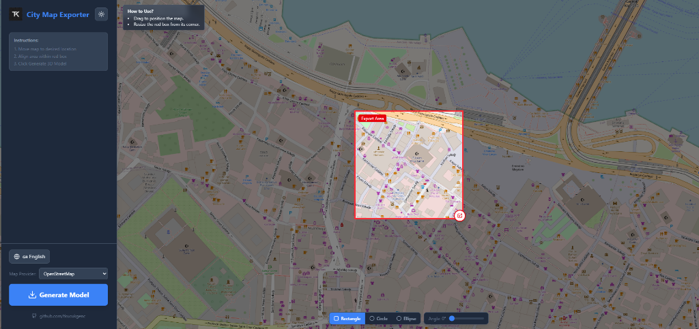
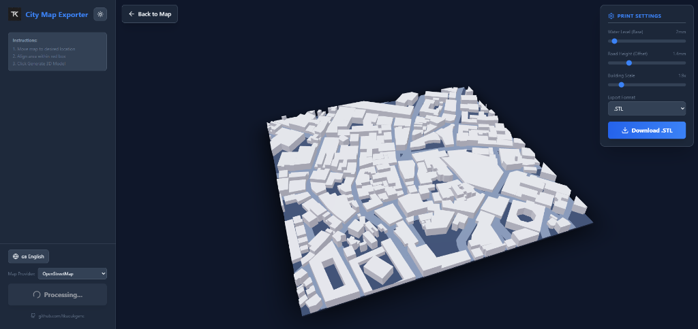

# 🏙️ City Map Exporter

Export any city area as a **3D printable model** directly from your browser. Select a region on the map, generate a 3D scene with buildings and roads, fine-tune print settings, and download in STL, OBJ, GLTF, or PLY format — no sign-up or API key required.

<p align="center">
  
</p>

<p align="center">
  
</p>

---

## ✨ Features

- 🗺️ **Interactive Map Selection** — Pan, zoom, and select any area in the world
- 📐 **Flexible Shapes** — Rectangle, Circle, or Ellipse selection with rotation (0–180°)
- 🏗️ **3D Model Generation** — Buildings with realistic heights based on OpenStreetMap data + road networks
- 🌊 **Water Rendering** — Rivers, lakes, and bays rendered as a distinct layer with adjustable height
- 🎨 **Custom Colors** — Change water, ground, road, and building colors via built-in color pickers
- 📦 **Multiple Export Formats** — STL, OBJ, GLTF/GLB, PLY
- 🌐 **10 Languages** — English (default), Turkish, Spanish, Russian, German, Italian, Chinese, Japanese, French, Arabic
- 🌓 **Dark / Light Theme**
- 🗺️ **7 Map Tile Providers** — OpenStreetMap, CartoDB Positron, CartoDB Dark, Stamen Toner, Stamen Watercolor, OSM Bright, OpenTopoMap
- ⚙️ **Adjustable Print Parameters** — Water level, ground offset, road offset, water height, building scale
- 🔄 **3D Preview** — Orbit, zoom, and inspect the model before downloading
- 🐳 **Docker Ready** — One-click setup

---

## 🚀 Installation & Setup

### Prerequisites

Choose one of the following:
- **Docker** (for one-click containerized setup)
- **Node.js 18+** (for local development)

---

### 🪟 Windows

**Option A: Docker (Recommended)**

1. Install [Docker Desktop for Windows](https://www.docker.com/products/docker-desktop/)
2. Make sure Docker Desktop is running
3. Double-click **`run_app.bat`** in the project folder
4. Open **http://localhost:8080** in your browser

**Option B: Node.js**

1. Install [Node.js 18+](https://nodejs.org/)
2. Open PowerShell or Command Prompt in the project folder:
```powershell
npm install
npm run dev
```
3. Open **http://localhost:5173** in your browser

---

### 🐧 Linux

**Option A: Docker**

```bash
# Install Docker (Ubuntu/Debian)
sudo apt update && sudo apt install -y docker.io docker-compose
sudo systemctl start docker

# Clone and run
git clone https://github.com/tkucukgenc/city-map-exporter.git
cd city-map-exporter
docker-compose up --build -d
```
Open **http://localhost:8080**

**Option B: Node.js**

```bash
# Install Node.js 18+ (via nvm)
curl -o- https://raw.githubusercontent.com/nvm-sh/nvm/v0.39.7/install.sh | bash
source ~/.bashrc
nvm install 18
nvm use 18

# Clone and run
git clone https://github.com/tkucukgenc/city-map-exporter.git
cd city-map-exporter
npm install
npm run dev
```
Open **http://localhost:5173**

---

### 🍎 macOS

**Option A: Docker**

1. Install [Docker Desktop for Mac](https://www.docker.com/products/docker-desktop/)
2. Open Terminal in the project folder:
```bash
git clone https://github.com/tkucukgenc/city-map-exporter.git
cd city-map-exporter
docker-compose up --build -d
```
3. Open **http://localhost:8080**

**Option B: Node.js**

```bash
# Install Node.js via Homebrew
brew install node@18

# Clone and run
git clone https://github.com/tkucukgenc/city-map-exporter.git
cd city-map-exporter
npm install
npm run dev
```
Open **http://localhost:5173**

---

### � Stopping the Application

**Docker:**
```bash
docker-compose down
```

**Node.js:** Press `Ctrl + C` in the terminal

---

## �📖 How to Use

1. **Navigate** the map to your desired city or neighborhood
2. **Choose a shape** — Rectangle, Circle, or Ellipse (bottom toolbar)
3. **Resize** by dragging the corner handle
4. **Rotate** using the angle slider (available for Rectangle & Ellipse)
5. Click **"Generate Model"** in the sidebar
6. **Fine-tune** the print settings (see below)
7. **Choose your format** (STL, OBJ, GLB, PLY) and click **Download**

---

## ⚙️ Print Settings

The 3D preview panel includes adjustable parameters to fine-tune the exported model for your needs:

| Parameter | Default | Range | Description |
|-----------|---------|-------|-------------|
| **Water Level (Base)** | 2 mm | 1–20 mm | Controls the base plate thickness (STL foundation height). Increase for a sturdier base when 3D printing. |
| **Ground Offset** | 1 mm | 0–5 mm | Elevates roads and buildings above the water level, creating a visible cliff between land and water areas. |
| **Road Offset** | 1 mm | 0–5 mm | Controls road layer thickness. Set to 0 for paper-thin roads. |
| **Water Height** | 0.5 mm | 0–5 mm | Controls the water layer thickness. Adjust to make rivers and bays more or less prominent. |
| **Building Scale** | 1x | 0.5–10x | Multiplier for building heights. Increase for a more dramatic skyline effect. |
| **Color Pickers** | — | — | Customize colors for water (default: blue), ground (brown), roads (grey), and buildings (white). |

### Use Cases

- **3D Printing** — Export as STL, adjust water level for a solid base, and scale buildings to get visible detail at your print size.
- **Architecture & Urban Planning** — Visualize city layouts, building density, and road networks in 3D.
- **Souvenirs & Gifts** — Create a personalized 3D model of your hometown, a travel destination, or a meaningful location.
- **Education** — Teach geography, urban design, or 3D modeling concepts with real-world city data.
- **Game Development** — Export as GLTF/GLB for use in game engines like Unity, Unreal, or Godot.
- **Laser Cutting / CNC** — Use the exported models as reference for physical fabrication projects.

---

## ⚠️ STL Repair Note

Exported STL files may contain **non-manifold edges** due to the nature of procedural geometry generation from OpenStreetMap data. Most slicer software (Cura, PrusaSlicer, etc.) will show warnings about this.

**Before 3D printing, it is recommended to repair the mesh using one of these free tools:**

- 🔧 [Nano3DTech STL Repair](https://www.nano3dtech.com/repair-3d-stl-file/) — Online, instant repair
- 🔧 [Formware Online STL Repair](https://www.formware.co/onlinestlrepair) — Online, handles complex issues
- 🔧 [Microsoft 3D Builder](https://apps.microsoft.com/detail/9wzdncrfj3t6) — Free Windows app, auto-repairs on import
- 🔧 [Meshmixer](https://meshmixer.com/) — Free desktop app, advanced repair tools

Most slicers also have built-in repair functionality that can fix minor issues automatically.

---

## 📐 Export Formats

| Format | Extension | Best For |
|--------|-----------|----------|
| **STL** | `.stl` | 3D printing, CAD software |
| **OBJ** | `.obj` | General 3D modeling, Blender |
| **GLTF/GLB** | `.glb` | Web, AR/VR, game engines (Unity, Unreal) |
| **PLY** | `.ply` | Point cloud software, academic research |

---

## 🗺️ Map Tile Providers

Switch between providers in the sidebar without losing your position or settings:

| Provider | Style | Best For |
|----------|-------|----------|
| **OpenStreetMap** | Classic, detailed | General use |
| **CartoDB Positron** | Clean, minimal light | Presentations |
| **CartoDB Dark Matter** | Dark theme | Dark mode users |
| **Stamen Toner** | Black & white | Architectural views |
| **Stamen Watercolor** | Artistic, painterly | Creative projects |
| **OSM Bright** | Bright, vivid | High contrast |
| **OpenTopoMap** | Topographic | Terrain context |

> **Note:** All providers use the same underlying OpenStreetMap building/road data for 3D generation. The tile provider only changes the visual appearance of the 2D map.

---

## 🌐 Supported Languages

| Language | Flag |
|----------|------|
| English | 🇬🇧 |
| Türkçe | 🇹🇷 |
| Español | 🇪🇸 |
| Русский | 🇷🇺 |
| Deutsch | 🇩🇪 |
| Italiano | 🇮🇹 |
| 中文 | 🇨🇳 |
| 日本語 | 🇯🇵 |
| Français | 🇫🇷 |
| العربية | 🇸🇦 |

---

## �️ Tech Stack

| Layer | Technology |
|-------|-----------|
| **Frontend** | React 19, TypeScript, Vite |
| **3D Engine** | Three.js, React Three Fiber, Drei |
| **Map Rendering** | MapLibre GL |
| **Geo Processing** | Turf.js, osmtogeojson |
| **Data Source** | OpenStreetMap / Overpass API |
| **Styling** | Tailwind CSS 4 |
| **Containerization** | Docker |

---

## �📁 Project Structure

```
city-map-exporter/
├── src/
│   ├── components/
│   │   ├── MapSelector.tsx       # Interactive map + shape selection
│   │   ├── SceneProcessor.tsx    # Data fetching + 3D scene generation
│   │   ├── PreviewCanvas.tsx     # Three.js preview + export
│   │   ├── LanguageSwitcher.tsx  # Language dropdown
│   │   └── ThemeToggle.tsx       # Dark/Light switch
│   ├── utils/
│   │   └── geometry.ts           # Geo coordinates → 3D mesh conversion
│   ├── i18n/
│   │   └── translations.ts      # All 10 language translations
│   ├── context/                  # React Context (Theme + Language)
│   └── App.tsx                   # Main application shell
├── public/                       # Static assets (logo, favicon)
├── screenshots/                  # README images
├── Dockerfile                    # Production container config
├── docker-compose.yml            # Container orchestration
├── run_app.bat                   # Windows one-click launcher
└── package.json
```

---

## 🔧 Building for Production

```bash
npm run build
```

The output will be in the `dist/` directory, ready to be served by any static file server.

```bash
# Serve locally
npx serve dist
```

---

## 📝 License

MIT License — see [LICENSE](LICENSE) for details.

---

## 👤 Author

**Mustafa Talha Küçükgenç**

- GitHub: [@tkucukgenc](https://github.com/tkucukgenc)

---

## 🐛 Issues & Feedback

If you encounter any bugs, have feature requests, or need help getting started, feel free to [open an issue](https://github.com/tkucukgenc/city-map-exporter/issues) on GitHub. Contributions and pull requests are also welcome!

---

<p align="center">
  Built with React, Three.js, and OpenStreetMap ❤️
</p>
